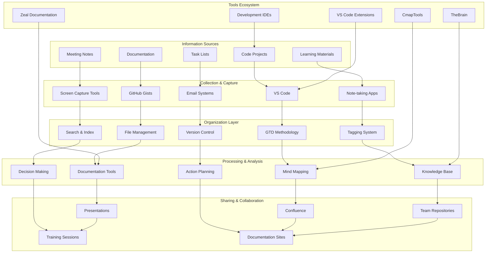
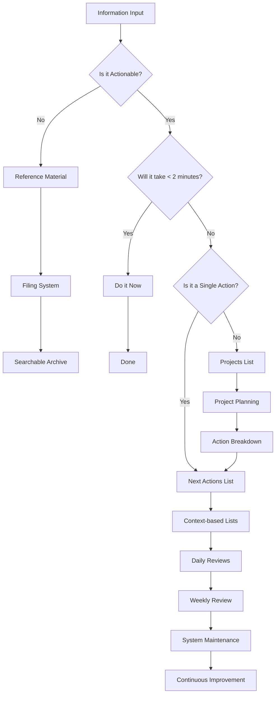
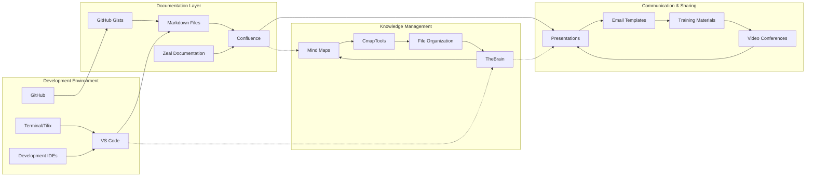
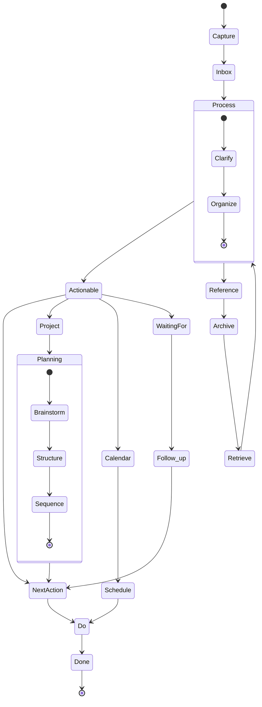
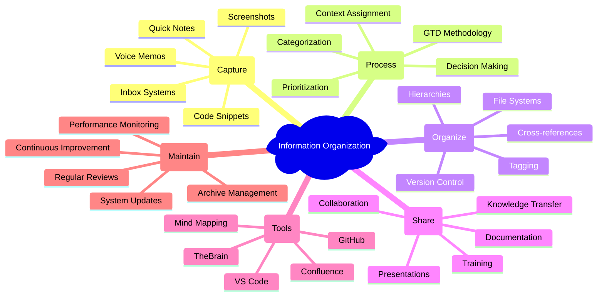
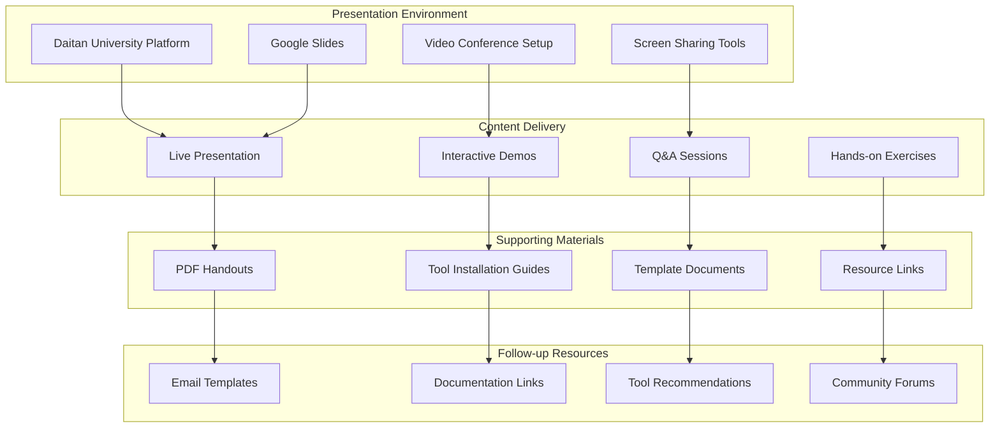
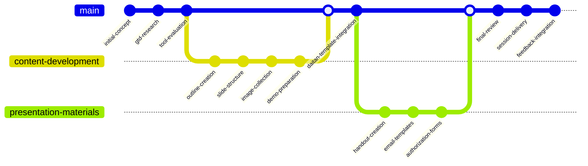

# **Presentation Organize and Share Information**

[Homepage](https://github.com/enogrob/presentation-organize-and-share-information)


## Contents

- [Summary](#summary)
- [Architecture](#architecture)
  - [Key Concepts](#key-concepts)
  - [Alternative Perspectives](#alternative-perspectives)
- [Tech Stack](#tech-stack)
- [Getting Started](#getting-started)
- [Usage Examples](#usage-examples)
- [Contributing Guidelines](#contributing-guidelines)
- [Troubleshooting](#troubleshooting)
- [License](#license)
- [References](#references)

### Summary

The "Organize and Share Information" presentation is a comprehensive educational resource developed for Daitan University's Learning Session program. This presentation focuses on methodologies, tools, and best practices for effectively organizing, managing, and sharing information in professional and personal contexts. The project appears to be specifically designed for software engineers and knowledge workers who need to efficiently handle large amounts of information across multiple platforms and tools.

The presentation covers fundamental concepts from David Allen's "Getting Things Done" (GTD) methodology, integrated with modern digital tools and development environments. It addresses the challenges faced by technical professionals in managing project documentation, code snippets, development workflows, and collaborative knowledge sharing. The content is structured to provide practical, actionable strategies for improving productivity and information accessibility.

The project serves as both an educational resource and a practical guide, targeting software developers, project managers, and technical teams who want to establish effective information management systems. It emphasizes the integration of various tools including VS Code extensions, documentation platforms like Confluence, note-taking applications, and version control systems to create a cohesive information ecosystem.

### Architecture



#### Alternative Perspectives

<details>
<summary><strong>1. GTD Workflow - Process Flow Diagram</strong> (Click to expand)</summary>



</details>

<details>
<summary><strong>2. Tool Integration Architecture</strong> (Click to expand)</summary>



</details>

<details>
<summary><strong>3. Information Flow State Diagram</strong> (Click to expand)</summary>



</details>

<details>
<summary><strong>4. Mind Map - Information Organization Concepts</strong> (Click to expand)</summary>



</details>

<details>
<summary><strong>5. Deployment Architecture - Learning Session Setup</strong> (Click to expand)</summary>



</details>

<details>
<summary><strong>6. Project Development Timeline</strong> (Click to expand)</summary>



</details>

#### Key Concepts

* **Getting Things Done (GTD)**: A productivity methodology developed by David Allen that provides a systematic approach to capturing, processing, organizing, and reviewing tasks and information to achieve stress-free productivity.

* **Inbox Zero**: A systematic approach to email and task management where all incoming items are regularly processed and moved to appropriate action lists or reference systems.

* **Two-Minute Rule**: A GTD principle stating that if an action takes less than two minutes to complete, it should be done immediately rather than being added to a task list.

* **Contexts**: Organizational categories based on the tools, location, or mindset required to complete actions (e.g., @computer, @calls, @errands).

* **Weekly Review**: A systematic process of reviewing all projects, actions, and commitments to maintain clarity and control over one's workflow and obligations.

* **Mind Mapping**: A visual thinking tool that represents information hierarchically, showing relationships between concepts through branches and nodes.

* **Knowledge Management**: The systematic process of capturing, distributing, and effectively using organizational knowledge and expertise.

* **Information Architecture**: The structural design of shared information environments, organizing and labeling content to support usability and findability.

* **Version Control**: A system for tracking and managing changes to documents, code, and other information assets over time.

* **Collaborative Documentation**: The practice of creating and maintaining shared documentation that multiple team members can contribute to and access.

* **Cross-platform Integration**: The ability to use and synchronize information across multiple tools and platforms seamlessly.

* **Continuous Integration/Continuous Deployment (CI/CD)**: Development practices that automate the integration and deployment of code changes, applicable to information management workflows.

### Tech Stack

**Analysis Sources**: Based on the project structure, VS Code extensions list, images, and resource files, this presentation utilizes a comprehensive technology stack for demonstration and practical application.

**Categories relevant to this presentation project**:

* **Presentation Platform**: Google Slides for primary presentation delivery, integrated with Daitan University's official template system
* **Documentation Tools**: 
  - Confluence for collaborative documentation and knowledge sharing
  - Markdown for lightweight documentation and README files
  - PDF generation for handouts and reference materials
* **Development Environment**: 
  - Visual Studio Code as the primary development and note-taking environment
  - Multiple VS Code extensions for enhanced productivity (Ruby, Python, Git, Docker, Kubernetes support)
  - Terminal applications (Tilix) for command-line operations
* **Version Control**: 
  - Git for version control and collaboration
  - GitHub for repository hosting and Gist creation
  - GitHub integration tools for seamless workflow management
* **Knowledge Management Tools**:
  - TheBrain for mind mapping and concept visualization
  - CmapTools for creating concept maps and relationship diagrams
  - Zeal for offline documentation access
* **File Management**: 
  - Desktop file organization systems
  - Cross-platform file synchronization
  - Structured folder hierarchies for project organization
* **Communication Tools**:
  - Email templates for structured communication
  - Video conferencing platforms (Zoom) for remote presentations
  - Screen capture tools (Shutter) for creating instructional materials
* **Productivity Extensions**:
  - Vim keybindings for efficient text editing
  - Git workflow enhancements (GitLens, Git Graph)
  - Container and cloud development tools (Docker, Kubernetes extensions)
  - Language-specific tools (Ruby, Python, YAML support)
* **Cross-platform Compatibility**: Tools and practices that work across different operating systems and development environments
* **Office Integration**: Microsoft Office compatibility for document sharing and collaboration

### Getting Started

This presentation project is designed for implementation in educational and professional settings. Here's how to set up and utilize the materials:

**System Requirements**:
- Visual Studio Code (latest version)
- Git for version control
- Access to Google Slides or compatible presentation software
- Web browser for accessing online documentation tools

**Installation Steps**:

1. **Clone or Download the Presentation Materials**:
   ```bash
   git clone https://github.com/enogrob/presentation-organize-and-share-information.git
   cd presentation-organize-and-share-information
   ```

2. **Review Presentation Content**:
   - Open the main presentation file (`docs/presentation-organize-and-share-information.odp`)
   - Review PDF handouts in the `docs/` folder
   - Examine supporting images in the `images/` folder

3. **Set Up Development Environment** (for hands-on demonstrations):
   - Install Visual Studio Code
   - Install recommended extensions from `vscode/vscode-extensions.txt`:
     ```bash
     # Install VS Code extensions (if using VS Code CLI)
     cat vscode/vscode-extensions.txt | xargs -L 1 code --install-extension
     ```

4. **Configure Documentation Tools** (optional):
   - Set up Confluence access for collaborative documentation
   - Install TheBrain for mind mapping exercises
   - Configure Zeal for offline documentation access

5. **Prepare Presentation Environment**:
   - Test screen sharing capabilities
   - Verify access to all demo tools and applications
   - Prepare backup materials for offline scenarios

**Configuration Steps**:
- Customize presentation templates with organizational branding
- Adapt examples to match audience's specific tools and workflows
- Prepare environment-specific tool demonstrations

**Verification**:
- Ensure all presentation slides are accessible
- Test tool demonstrations in the target environment
- Verify that all referenced resources and links are functional

### Usage Examples

**Example 1: Setting Up a GTD Workflow in VS Code**

Demonstrate how to organize project information using VS Code workspaces:

```markdown
# Project Organization Structure
├── 📁 inbox/
│   ├── quick-notes.md
│   └── ideas.md
├── 📁 projects/
│   ├── current-sprint/
│   └── backlog/
├── 📁 reference/
│   ├── documentation/
│   └── resources/
└── 📁 archive/
    └── completed-projects/
```

Show how to use VS Code extensions for task management and note organization.

**Example 2: Creating Effective Documentation in Confluence**

Demonstrate best practices for structuring team documentation:

```markdown
# Team Knowledge Base Structure
## 🏠 Home
- Team overview and contacts
- Quick access to frequently used resources

## 📚 Processes & Procedures
- Development workflows
- Code review guidelines
- Deployment procedures

## 🔧 Tools & Setup
- Development environment setup
- Tool configurations
- Troubleshooting guides

## 📊 Projects
- Active project documentation
- Project retrospectives
- Lessons learned
```

**Example 3: Using Mind Maps for Information Architecture**

Show how to create visual representations of complex information using TheBrain or CmapTools:

1. Start with a central concept
2. Branch out to major categories
3. Add detailed subcategories and relationships
4. Use color coding for different types of information
5. Link related concepts across different branches

**Example 4: Implementing the Two-Minute Rule**

Practical demonstration of quick task processing:

```markdown
# Inbox Processing Workflow
1. 📥 Capture: New email/task arrives
2. 🤔 Clarify: What is it? Is it actionable?
3. ⚡ Decide: 
   - If < 2 minutes: Do it now
   - If > 2 minutes: Schedule or delegate
   - If not actionable: Delete, reference, or someday/maybe
4. ✅ Organize: Place in appropriate system
5. 🔄 Review: Regular system maintenance
```

### Contributing Guidelines

This presentation project welcomes contributions from educators, trainers, and productivity enthusiasts. Here's how to contribute:

**Contribution Process**:
1. Fork the repository
2. Create a feature branch for your improvements
3. Make your changes with clear, descriptive commit messages
4. Submit a pull request with detailed description of changes
5. Participate in review process and address feedback

**Types of Contributions Welcome**:
- Additional tool demonstrations and examples
- Updated screenshots and visual materials
- New productivity techniques and methodologies
- Translation of materials to other languages
- Case studies and real-world application examples

**Content Guidelines**:
- Maintain focus on practical, actionable advice
- Ensure all examples are tested and functional
- Use clear, accessible language appropriate for technical audiences
- Include proper attribution for methodologies and tools referenced
- Maintain consistency with existing presentation structure

**Technical Standards**:
- Follow markdown formatting standards for documentation
- Optimize images for presentation use (appropriate resolution and file size)
- Test all code examples and tool configurations
- Maintain compatibility with common presentation platforms

**Reporting Issues**:
- Use the GitHub issue tracker for bug reports and feature requests
- Provide detailed descriptions including environment information
- Include screenshots or examples when reporting presentation issues
- Tag issues appropriately (bug, enhancement, documentation, etc.)

### Troubleshooting

**Common Issues and Solutions**:

**Q: Presentation slides are not displaying correctly**
A: Ensure you're using a compatible version of LibreOffice or convert to PowerPoint format. Check that all referenced images are in the correct `images/` folder.

**Q: VS Code extensions from the list won't install**
A: Verify you have the latest version of VS Code. Some extensions may have been deprecated - check the VS Code marketplace for updated alternatives.

**Q: Demo tools are not working during presentation**
A: Always have backup screenshots and pre-recorded demonstrations. Test all tools in the presentation environment beforehand.

**Q: Links to external resources are broken**
A: The `.webloc` files contain web bookmarks that may become outdated. Verify all external links before presenting and have backup local copies of important resources.

**Q: Participants can't access collaborative tools**
A: Prepare alternative demonstration methods and ensure you have guest access options for tools like Confluence and TheBrain.

**Additional Help Resources**:
- VS Code documentation: https://code.visualstudio.com/docs
- GTD methodology resources: David Allen's "Getting Things Done" book
- Confluence documentation: Atlassian's official guides
- TheBrain tutorials: Available on the official TheBrain website

### License

**License Information**: This presentation project appears to be created for educational purposes within the Daitan University Learning Session program. 

**Usage Rights**: The project includes templates and authorization forms indicating it's designed for internal training and educational use. Users should:
- Respect any organizational branding and templates
- Obtain appropriate permissions for external use
- Credit original methodologies and tools referenced
- Follow fair use guidelines for educational materials

**Third-party Content**: The presentation references various proprietary tools and methodologies. Users should ensure they have appropriate licenses for:
- GTD methodology implementation
- Commercial productivity tools demonstrated
- Development tools and extensions shown
- Any organizational templates or branding used

### References

**Official Documentation and Primary Sources**:
* [Getting Things Done Official Website](https://gettingthingsdone.com/) - David Allen's comprehensive productivity methodology and official resources
* [Visual Studio Code Documentation](https://code.visualstudio.com/docs) - Complete guide to VS Code features, extensions, and best practices
* [Atlassian Confluence Documentation](https://confluence.atlassian.com/) - Official documentation for collaborative workspace and knowledge management
* [TheBrain Official Resources](https://www.thebrain.com/) - Mind mapping and knowledge management platform documentation

**Educational and Training Resources**:
* [Daitan University Learning Session Framework](mailto:rnogueira@daitan.com) - Internal training program structure and guidelines as referenced in project emails
* [GitHub Gist Documentation](https://docs.github.com/en/github/writing-on-github/editing-and-sharing-content-with-gists) - Code snippet sharing and collaboration best practices
* [Mind Mapping with CmapTools](https://cmap.ihmc.us/) - Concept mapping software for knowledge visualization

**Development Tools and Extensions**:
* [VS Code Extensions Marketplace](https://marketplace.visualstudio.com/) - Comprehensive library of productivity extensions demonstrated in the presentation
* [Git Documentation](https://git-scm.com/doc) - Version control fundamentals for information management
* [Docker and Kubernetes for Development](https://docs.docker.com/) - Containerization tools referenced in the VS Code extensions list

**Productivity and Information Management Articles**:
* [Why Every Software Engineer Should Use Vim](https://levelup.gitconnected.com/) - Referenced in project resources for editor efficiency
* [VS Code Extensions for Enhanced Development](https://betterprogramming.pub/) - Current extension recommendations and productivity tips
* [Ruby Development with VS Code](https://medium.com/) - Language-specific productivity enhancements

**Template and Presentation Resources**:
* [Organize and Share Information - Google Slides](docs/presentation-organize-and-share-information%20-%20Google%20Slides.webloc) - Main presentation slides for the Daitan University Learning Session
* [Organize and Share Information PDF](docs/Organize%20and%20Share%20Information_ba6077cf34f94339b4c5e03946cf9ee3-010422-1640-94.pdf) - Complete presentation handout and reference material
* [Organize and Share Information - Confluence](docs/Organize%20and%20Share%20Information%20-%20Martins%20Nogueira,%20Roberto%20Luiz%20-%20Confluence.webloc) - Confluence documentation and collaborative workspace
* [Presentation LibreOffice File](docs/presentation-organize-and-share-information.odp) - OpenDocument presentation format for cross-platform compatibility


